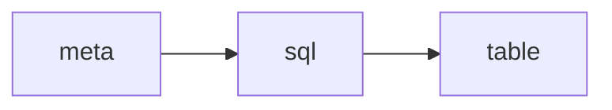

# feat

## P0001-F0001 meta的定义

借鉴xorm的定义对meta进行相关的定义

```json
{
  "table": {
    "name": "t_user",
    "comment": "user table"
  },
  "columns": [
    {
      "name": "ID",
      "type": "ID",
      "comment": "用户id",
      "primary": true
    },
    {
      "label": "表头：姓名",
      "name": "Name",
      "type": "varchar",
      "comment": "user name",
      "unique": true
    },
    {
      "label": "状态",
      "name": "status",
      "type": "enum",
      "default": "enabled",
      "option": [
        "enabled",
        "disabled"
      ],
      "comment": "状态：enabled打开，disabled关闭",
      "index": true
    },
    {
      "label": "总金额",
      "name": "amount",
      "type": "decimal",
      "index": true
    },
    {
      "label": "备注",
      "name": "remark",
      "type": "text",
      "nullable": true
    }
  ],
  "option": {
    "timestamps": true,
    "soft_deletes": true
  }
}

```
## P0001-F0002 meta to SQL


实现 CreateTableSQL、CreateTable TableMeta

## P0001-F0003 migrate

修改meta的定义，能够对数据库进行迁移

- [ ] 01 修改列名（按序号）
- [ ] 02 修改列类型，注意数据的迁移
- [ ] 03 修改列默认值
- [ ] 04 删除列
- [ ] 05 增加列索引
- [ ] 06 删除列索引
- [ ] 07 增加一列在所有列最前面
- [ ] 08 增加一列在所有列中间
- [ ] 09 增加一列在所有列最后