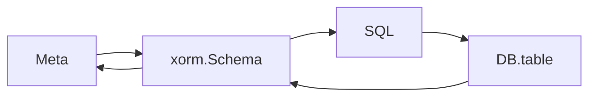

# meta

## 大纲

采用元数据描述文件 + 表格数据的形式，对业务数据进行快速构建
元数据完成以下核心功能
    ~~1. 实体与表的映射定义，可以参考`xorm`/`gorm`太简单~~
    1. 自定义json结构，用于描述各个字段信息
    2. 实体与实体间的关系； 各项业务约束关系
    3. 相关质量的定义，用于验证。
表格数据
    1. 采用`excel`表格来填充数据
    2. 首行都为表字段定义
    3. 第2行为字段`comment`信息，如果有。
    4. 尾部增加2列，第一列为班次执行后的状态，第二列为`crc`码
        状态分为：
            None - 未执行任何变动
            Update - 更新
            Insert - 插入
            Delete - 删除；非必需，如果本身实体设计为软删除，则可以通过自行修改软删除状态来实现，此时状态为Update

### P0001 通过meta数据构建表

作为管理系统实施者或者维护着
希望通过快速的表定义，如json/yaml等形式来描述数据表，并能快速地生成表原型
以便能快速地响应用户的需求

### P0002 通过数据表结构来反向生成meta文件

作为管理系统实施者或者维护着
希望通过现有的数据表来生成导出需求001中所定义的json/yaml，以便通过修改meta文件，来快速迁移或者修改表
已便能快速响应因需求导致的模型变动

### P0003 通过meta+excel更新数据

作为管理系统实施者或者维护着
希望通过meta文件，以及关联的excel表格，快速地向数据表中导入数据/更新数据
以便完成对数据表中的数据同步与更新
约束：
    需要考虑 插入/删除（表中有，excel中已经没有）/更新
    当前不考虑相关变动事件带来的其他关联数据的变化，预留扩展。

### P0004 通过meta快速生成excel模板

作为管理系统实施者或者维护着
希望通过meta文件，快速生成excel模板
已方便从客户那里收资，并快速填充数据到表中。
